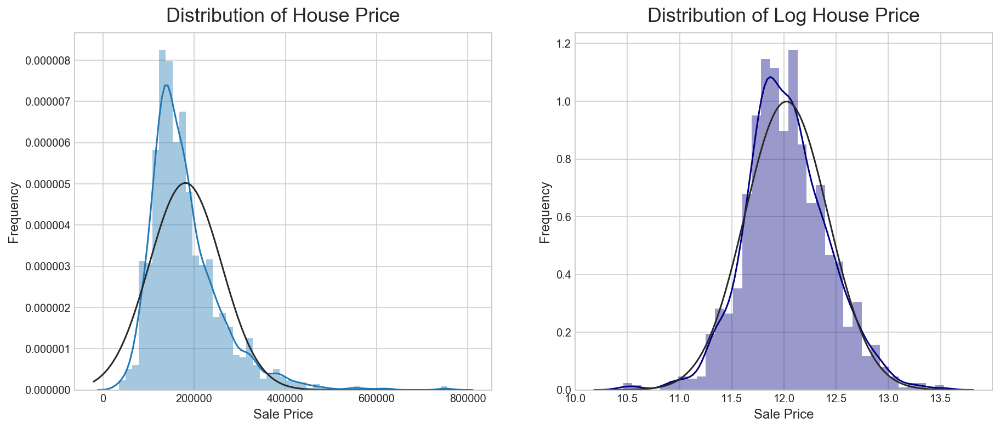
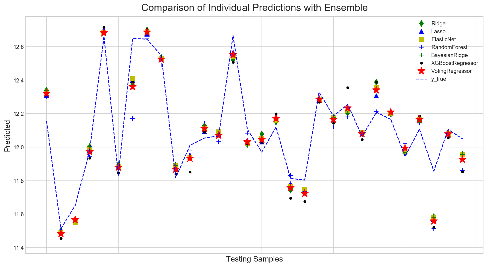

## Ames Housing Data and Kaggle Challenge
---

### Problem Statement:

Zillow will often indicate "Estimated home price" to inform users about the market rates of homes, even when they are not
yet explicitly for sale. More accurate depictions of home values translates to more confidence in Zillow's product.
Moreover, with better prediction, more reliability on the tool and consequently better user engagement what leads to
greater possibility for advertising revenues.

Using data given on properties sold in Ames, Iowa, my task is to create the best linear regression model to predict the sale
price of properties based on an extensive list of properties features.

After creating models with the given dataset, the model was tested on a new dataset without sale prices. Using the same
techniques to clean the dataset the models were used to predict those prices based on the features selected to run the
regression model on.

The main performance indicator used to evaluate and tune models was the RMSLE (Root Mean Squared Log Error).

### Steps Taken:
A few of the steps taken were to Convert a few of the categorical features into numeric features. Moreover, By using the data dictionary a lot of null values were actually replaced with a '0' or 'None'.

The imputation techniques used were mainly using the median/mode of the training dataset into both training and testing datasets, avoiding any data leakage.

The distribution of the label column was very skewed and so it was log-transformed providing the following curve:

A couple of outliers were removed from the data by analyzing scatterplots for the numeric features and all categorical features were turned in to dummies.

For feature engineering the total square footage and total area of the properties were considered in the analysis as well as boolean features such as if the property had a pool/garage etc. Also, polynomial features were added in order to account for non-linear relationships between highest correlated features with the target sale prices.

Features with a calculated skew of over 0.5 were also log-transformed in order to normalize the data distribution.

Following a plot with the first 30 data points on the testing set and predictions of all tested models as well as final Voting Regressor compared with the actual values.

### Conclusion:
- Final Model's Performance
  - RMSLE Test= 0.0085
  - R2 Train: 0.9627
  - R2 Test: 0.9275
  - Kaggle Score: 0.11704 RMSLE (Top 11%)

A few different models were trained and final predictions were submitted to Kaggle by using a Voting Regressor as an Ensembling Technique.

### Next Steps and Model Improvement:
- External Input to the Model
- New Imputation Techniques for Null Values
- Model Improvement other Ensemlbing Techniques - Stacking
